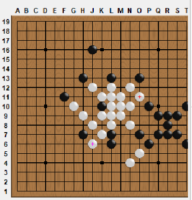
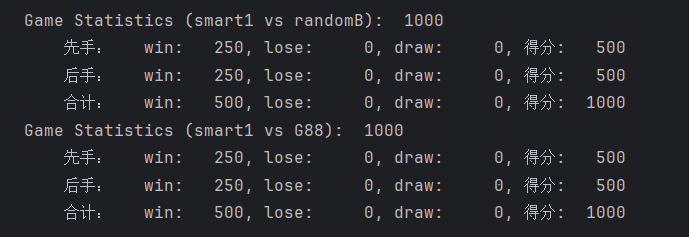

# sixStonesGame
中国海洋大学人工智能导论课大作业_六子棋对战AI
比起第一个实验，这里只需要在stud里编写你自己的AI即可 
- 主要就是重写findNextMove这个函数
- 第一阶段（V1）：偏重于着法生成，只看一步。
  - (a) 己方有胜着时，能够找到；
  - （b）设计能够快速计算威胁个数的算法，当对方威胁不多于两个时， 能够防守得住； 
  - (c) 选点有一定智能；
  - (d) 下棋过程中不会出现异常。
- 偏重于盘面估值、盘面更新及博弈树搜索。
  - (a) 能够快 速找出当前局面下双方的“有效路”，并能对局面进行快速评估；
  - (b) 改进着法生 成策略，能够高效展开博弈树搜索，进行正确的α-β剪枝。
- 能够进行“威胁空间搜索（TBS）” 或“蒙特卡洛树搜索“， 对前面阶段的程序保持高胜率。

可以看到要求还是蛮高的，尽力实现吧
## 1206实现smart1初级版本
行棋逻辑如下：
1. 判断场面上有无胜手
2. 判断对面下一轮有无胜手
3. 自主行棋
### 这三大部分的核心都是相同的：找到场面上的最大可扩展连通块
遍历movelist，从size-2处逆序遍历，step为2，就能遍历所有场上的己方棋子  
对于每个己方棋子，在四个直线方向上判断已联通棋子数量（不包含本棋子）  
方法是每个直线方向计算forwardstep和backwardstep就是两端的已扩展棋子数  
显然每端只需检查4个位置即可（也就是最多连成5个） 
如果发现 if forward+back >= maxblocklen  进行判断
（当maxblocklen>=3时）说明有可能存在胜手  
此时有4类情况：
- 四子之外的两端都可以下，胜手就是两端的位置
- 四子之外的一端被堵（边界/对手棋子），另一端有连续两个位置刻下，胜手在同侧
- 四子之外的一端被堵，另一端只有一个位置可下，无胜手
- 四子之外的两端被堵，无胜手  
任务P1和P3是一致的，赋值后更新maxblocklen即可
对于P2任务需要在maxblcoklen==3时更新
在每次if结尾判断是否出现了胜手/防手，用全局flag控制外部的输出
如果没有出现，在P1阶段找到的位置就是最佳落子位置（也就是对于最大可扩展连通块进行扩展）

### 小样本测试表明已经达到了阶段一的要求
对其他两个智障AI保持100%非常轻松
自我对战的情况也还不错
下面是可以改进的点：
- 对于P3目前是把两颗子全部用于“进攻”，也就是寻找最佳落点，其实有另外两种下法
  - 攻守兼备，一颗子用于扩展最大连通块，一颗子用于防守对面的最大连通块
  - 乌龟形态，两克子全部用于防守  
- 由于FORWARD数组的顺序是固定的[列，行，正对角线、负对角线]，对于相同可扩展块长度  
  - 总是先沿着相同方向扩展（对角线方向），能否增加一些随机性？
  - 如何判断相同长度的可扩展的价值（中心位置应该比边缘位置更优）
- 胜手情况寻找不全，只考虑的从最大连通块向外扩展的情况，没有考虑联通两个相邻的块
  - 比如两个分离的2，之间的距离也是2，那就可以通过把他们连起来取胜
  - 同理对威胁的判断有狭隘
### 对战实况
可以看到老师给出的这个可视化很有点小问题：
- 行应该是从上到下的A-S而不是19-1
- 列应该是A-S，可以发现I不见了  

  
大部分时候是全胜，但有时候居然会输给randomB一把，很奇怪
